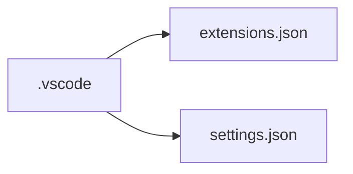
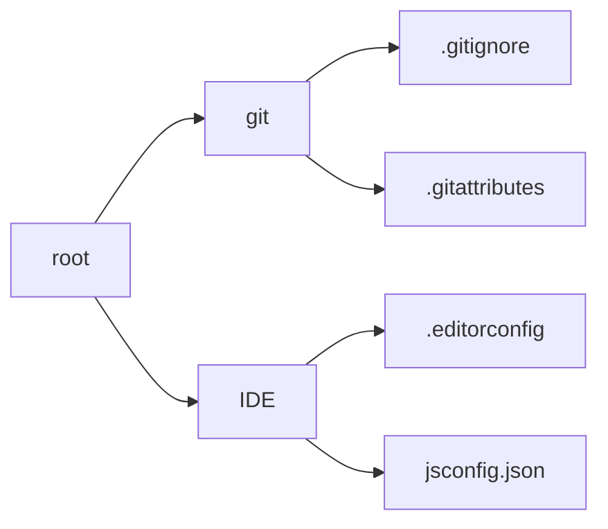
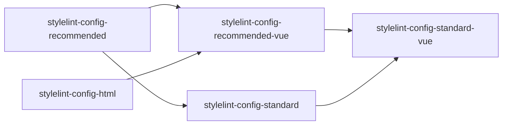

# Vue Web Template

Vite 5 + Vue 3 + Element Plus

## IDE 和插件

visual studio code

### 插件

1. vue.volar



### extensions.json 配置扩展

```json
{
  "recommendations": ["editorconfig.editorconfig", "esbenp.prettier-vscode", "dbaeumer.vscode-eslint", "stylelint.vscode-stylelint", "davidanson.vscode-markdownlint", "vue.volar"]
}
```

### settings.json 配置格式化等

```json

```

## 初始化

1. 创建项目: `npm create vite@latest`
1. 安装依赖: `npm i`
1. 调试: `npm run dev`
1. 构建: `npm run build`
1. 预览: `npm run preview`

## 项目配置

按照通用性从高到低



### .gitignore 过滤提交文件

<https://git-scm.com/docs/gitignore>
<https://github.com/github/gitignore>

```bash
node_modules
dist
package-lock.json
```

### .gitattributes 配置行尾格式

<https://git-scm.com/docs/gitattributes>
<https://github.com/gitattributes/gitattributes>

```bash
* text=auto
*.sh text eol=lf
*.bat text eol=crlf
*.cmd text eol=crlf
*.ps1 text eol=crlf
```

### .editorconfig 配置编辑器配置

<https://editorconfig.org/>

```bash
root = true

[*]
charset = utf-8
indent_style = space
indent_size = 2
end_of_line = lf
insert_final_newline = true
trim_trailing_whitespace = true

[*.md]
trim_trailing_whitespace = false
```

### jsconfig.json 配置项目

<https://code.visualstudio.com/docs/languages/jsconfig>

```json
{
  "compilerOptions": {
    "target": "ESNext",
    "module": "ESNext",
    "checkJs": true,
    "allowSyntheticDefaultImports": true,
    "baseUrl": ".",
    "paths": {
      "@/*": ["./*"]
    }
  },
  "include": ["**/*.js"],
  "exclude": ["node_modules", "dist"]
}
```

### 代码检查和格式化

#### prettier 配置格式化

<https://prettier.io/>

.prettier.js

```js
module.exports = {
  tabWidth: 2,
  semi: true,
  printWidth: 120,
  singleQuote: true,
  quoteProps: 'consistent',
  htmlWhitespaceSensitivity: 'strict',
  vueIndentScriptAndStyle: true,
}
```

.prettierignore

```bash
/dist/*
/node_modules/**

**/*.svg
**/*.sh
```

#### eslint 配置代码检查

<https://eslint.org/>

.eslintrc.js

```js

```

.eslintignore

```bash
node_modules
dist
```

#### stylelint 配置样式检查

<https://stylelint.io/>



.stylelintrc.js

```js
module.exports = {
  extends: ['stylelint-config-standard', 'stylelint-config-rational-order', 'stylelint-config-prettier', 'stylelint-config-recommended-vue'],
  defaultSeverity: 'warning',
  plugins: ['stylelint-order'],
  rules: {
    'at-rule-no-unknown': [
      true,
      {
        ignoreAtRules: ['plugin'],
      },
    ],
    'rule-empty-line-before': [
      'always',
      {
        except: ['after-single-line-comment', 'first-nested'],
      },
    ],
    'selector-pseudo-class-no-unknown': [
      true,
      {
        ignorePseudoClasses: ['deep'],
      },
    ],
  },
}
```

#### markdownlint 配置 Markdown 检查

<https://github.com/markdownlint/markdownlint>
<https://github.com/github/markdownlint-github>
<https://github.com/DavidAnson/markdownlint>

.markdownlint.json

```json
{
  "MD013": false,
  "MD024": false,
  "MD033": false,
  "MD040": false
}
```

.markdownlintignore

```bash
**/node_modules
**/dist
```

### .nvmrc 配置 node.js 版本

```bash
18
```

### .npmrc

<http://npm.github.io/installation-setup-docs/customizing/the-npmrc-file.html>

```bash
engine-strict = true
```
