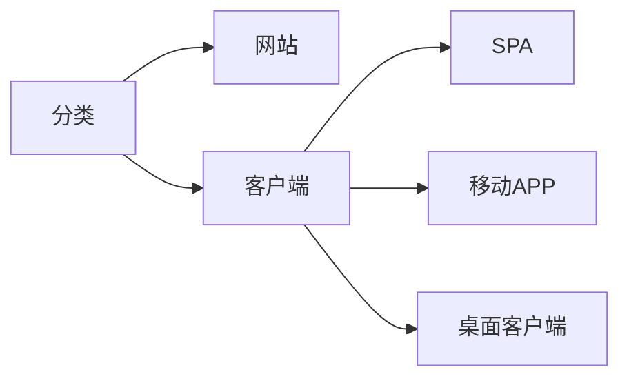

# 身份验证和授权

身份验证(AuthN)通常使用 [OpenID Connect](https://openid.net/developers/discover-openid-and-openid-connect/) 协议,授权(AuthZ)通常使用 [OAuth2](https://datatracker.ietf.org/doc/html/rfc6749) 协议. OpenID Connect(OIDC) 构建在 OAuth 2.0 的基础之上.

## 应用程序分类

## OAuth2

### 授权码类型
