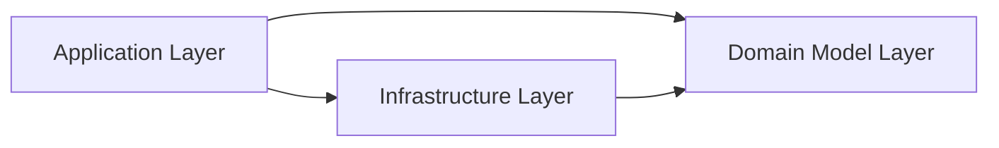

# 领域驱动设计

## 应用层 Application layer

1. 依赖领域层
   1. 提供实体
   1. 提供资源库接口
1. 依赖基础设施层
   1. 提供资源库实现

## 领域层 Domain model layer

1. 不依赖任何层
1. 定义实体、集合根和值对象
1. 资源库接口

## Infrastructure layer

1. 依赖领域层
   1. 引用实体，ORM 通过实体更新数据库
1. 引用其他类库
1. 其他基础设施 API

