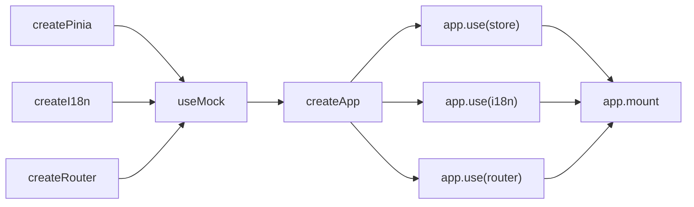
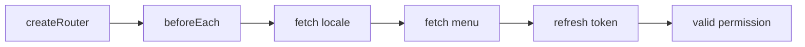
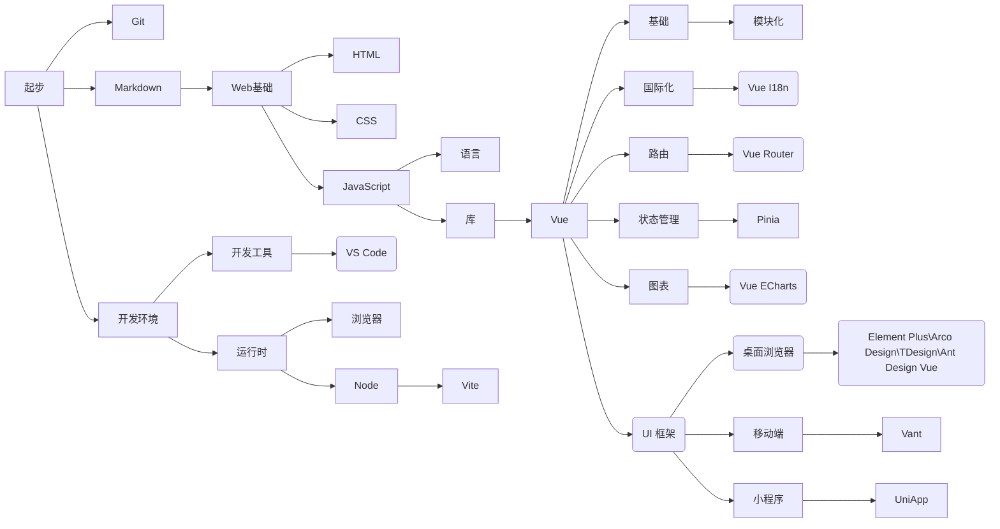
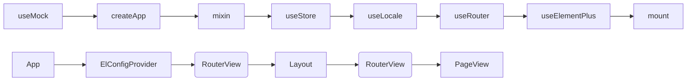

# 思维导图

- [x] Master
  - [x] Layout
  - [x] Header
    - [x] Logo
    - [x] Nav
  - [x] Footer
  - [x] Main
    - [x] Menu
    - [x] Main
      - [x] Tabs
      - [x] Breadcrumb
      - [x] Content
- [x] Views
  - [ ] Login
  - [ ] Register
  - [ ] Redirect
  - [ ] 403
  - [ ] 404
- [x] Components
  - [x] Markdown
  - [x] Chart
  - [x] Editor
  - [x] Icon
    - [x] Svg Icon
    - [x] Icon Select
  - [x] Form
    - [ ] Input
      - [x] Select
      - [x] Cascader
      - [ ] File
      - [ ] Filter
    - [ ] Validation
      - [ ] Remote
  - [x] List
    - [x] Query From
    - [x] Table List
      - [x] SubList Drawer
    - [x] Pagination
    - [x] Options
      - [x] Delete
      - [x] Dialog
      - [x] Reset
      - [x] Print
      - [x] Dialog
        - [x] Details
        - [x] Create
        - [x] Update
        - [x] Export
        - [x] Import
        - [x] Filter

## 应用启动

## 路由守卫

