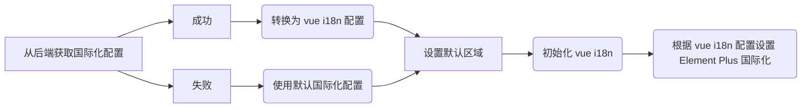

# 国际化 i18n

```mermaid
flowchart LR
从后端获取国际化配置 --> 成功 --> 2(转换为 vue i18n 配置) --> 设置默认区域
从后端获取国际化配置 --> 失败 --> 4(使用默认国际化配置) --> 设置默认区域 --> 6(初始化 vue i18n) --> 7(根据 vue i18n 配置设置 Element Plus 国际化)

```
