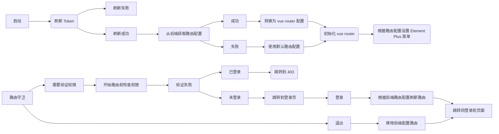

# 路由 router

```mermaid
flowchart LR
启动 --> refresh-token(刷新 Token) --> 刷新失败
refresh-token --> 刷新成功 --> 从后端获取路由配置 --> 成功 --> 2(转换为 vue router 配置) --> 3(初始化 vue router)
从后端获取路由配置 --> 失败 --> 4(使用默认路由配置) --> 3 --> 5(根据路由配置设置 Element Plus 菜单)

路由守卫 --> 需要验证权限 --> 开始路由前检查权限 --> 验证失败 --> 已登录 --> 403(跳转到 403)
验证失败 --> 未登录 --> 跳转到登录页 --> 登录 --> 根据后端路由配置刷新路由 --> 跳转回登录前页面
路由守卫 --> 退出 --> 移除后端配置路由 --> 跳转回登录前页面
```
